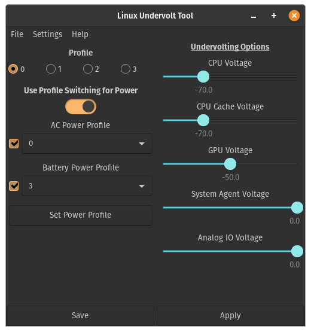

# Linux Undervolt Tool

A fairly simple tool built to mimic the basic functionality of ThrottleStop on Windows. Acts as a GUI so users are able to tell what they are doing without fiddling with the terminal.

Uses <a href="https://github.com/kitsunyan/intel-undervolt">intel-undervolt</a> to perform the undervolting, therefore it must be installed on the user's system. <a href="https://github.com/kitsunyan/intel-undervolt/blob/master/README.md">The guide to installing it can be found here</a>

To run this program, clone the repository or download it as a zip. Once extracted, run the main python file. This can be accomplished by opening a terminal in the folder and runnning the command `python3 main.py`. If the above command doesn't it work, either use `python main.py` or Python 3 needs to be installed on the machine. 

## GUI Instructions

Once changes have been made to a profile (by changing the slider values), the changes mst first be saved before applied. If not saved, the previous values present in the configuration file will be used. Thus, the program won't fail or throw an error message, but any change to the undervolt will not occur.

What the GUI currently looks like:

</img>

### TODO:

* Add buttons for toggles in intel-undervolt (daemon mode, enable)
* Create Backup of original intel-undervolt config file for easy reset to default
* Create power user settings toggle that enables more advanced features
